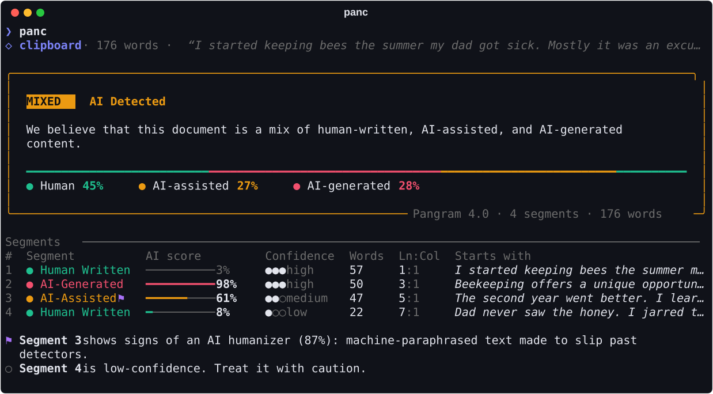
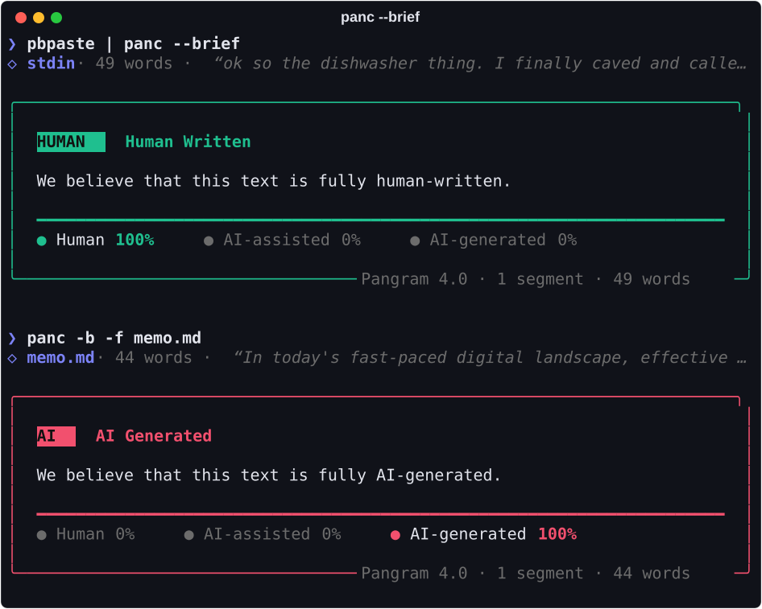

<h1 align="center">panc</h1>

<p align="center">
  <b>Was this written by AI? Ask <a href="https://www.pangram.com">Pangram</a> without leaving your terminal.</b><br>
  Copy some text, run <code>panc</code>, and see which parts read as human, AI-assisted or AI-generated.
</p>

<p align="center">
  
  <a href="https://github.com/astral-sh/uv"></a>
  <a href="https://github.com/astral-sh/ruff"></a>
  <a href="LICENSE"></a>
</p>

<p align="center">
  
</p>

## Why panc

- **No ceremony.** It reads your clipboard by default. Pipes, arguments and files work too.
- **The verdict at a glance.** A color-coded panel shows Pangram's call, plus a bar that maps
  where in the document the human, AI-assisted and AI-generated passages are.
- **Segment by segment.** Each segment gets an AI score, a confidence level, and the line and
  column where it starts in your input, so you can jump straight to it.
- **Humanizer detection.** Passages that Pangram 4 thinks were run through an AI "humanizer" (a
  tool that rewords AI text to slip past detectors) get a ⚑ flag.
- **Easy to script.** `--json` prints Pangram's raw response to stdout, while progress and errors
  go to stderr.
- **Nothing to configure.** It needs one environment variable and writes nothing to disk.

## Install

You'll need [uv](https://docs.astral.sh/uv/) and a [Pangram](https://www.pangram.com) API key.
From a clone of this repo:

```sh
uv tool install .
```

That puts `panc` on your `PATH`. Use `uv tool install --editable .` instead if you plan to hack
on it. Then give it your key, ideally in your shell profile:

```sh
export PANGRAM_API_KEY=your-key
```

## Usage

```sh
panc                        # analyze whatever is on your clipboard
pbpaste | panc              # …or pipe it in
panc "Some prose here"      # …or pass it directly (quotes optional)
panc -f essay.md            # …or read a file
panc -b                     # just the verdict
panc --json | jq .headline  # raw JSON for scripts
```

panc analyzes the first of these that applies:

1. `-f/--file PATH` (`-f -` reads stdin)
2. Arguments, joined with spaces (a lone `-` reads stdin)
3. Piped or redirected stdin
4. The clipboard: `pbpaste` on macOS; `wl-paste`, `xclip` or `xsel` on Linux; PowerShell on
   Windows

Before anything is sent, panc prints a one-line preview of the text (`◇ clipboard · 176 words ·
"…"`) so you know what's going to Pangram.

## Reading the output

<p align="center">
  
</p>

| | |
| --- | --- |
| **Badge** | Pangram's overall call: <code>HUMAN</code>, <code>MIXED</code> or <code>AI</code>, colored to match. |
| **Bar** | The document from start to finish, colored by how each stretch was classified: green for human, amber for AI-assisted, red for AI-generated. |
| **AI score** | How much AI involvement Pangram sees in the segment, from 0 to 100%. |
| **Confidence** | `●●●` high · `●●○` medium · `●○○` low. Low-confidence segments get a note below the table. |
| **Ln:Col** | Where the segment starts in the text you gave panc, counted from 1:1. |
| **⚑** | Pangram 4's humanizer detector fired on the segment. |

AI detection is probabilistic. Treat a verdict as evidence to weigh, not proof, especially on
short passages and low-confidence segments.

## Options

| Flag | |
| --- | --- |
| `-f, --file PATH` | Read the text from a file |
| `-b, --brief` | Only show the verdict panel |
| `-l, --link` | Ask Pangram for a shareable dashboard link |
| `-j, --json` | Print Pangram's raw response as JSON |
| `-m, --model NAME` | Model selector (default: `pangram-4`) |
| `--list-models` | List the models your API key can use |
| `-V, --version` | Show the version |
| `-h, --help` | Show help |

panc exits with `0` whenever the analysis completes, whatever the verdict. It exits with `1` on
errors (missing key, empty input, API failures) and `130` if you cancel it.

## How it works

panc talks to Pangram's [async detection API](https://docs.pangram.com/api-reference/ai-detection)
directly with [httpx](https://www.python-httpx.org): `POST /task`, then poll `GET /task/{id}`
until it finishes. It doesn't use Pangram's Python SDK, because talking to the API directly lets
the spinner show each stage and lets errors say what actually went wrong (a bad key, no credits
left, rate limiting) rather than a generic failure. Output is rendered with
[Rich](https://github.com/Textualize/rich).

Pangram reports segment positions against its own copy of the text, which Pangram 4 may
normalize. So panc maps each segment back onto your original input before printing a line and
column.

## Development

```sh
uv sync                         # set up the environment
uv run pytest                   # run the tests
uv run ruff check . && uv run ruff format .
uv run scripts/screenshots.py   # regenerate docs/*.svg
```

The screenshots are rendered from the sample API responses in `tests/fixtures/`, through the
same code panc uses for real results.

```
src/panc/
├── cli.py        # argument parsing, input resolution, the command itself
├── client.py     # Pangram API client
├── clipboard.py  # cross-platform clipboard reading
├── locate.py     # maps segment offsets back onto your input
└── render.py     # everything you see
```

## License

[CC0 1.0](LICENSE). panc is dedicated to the public domain.

panc is an independent project and isn't affiliated with or endorsed by Pangram Labs.
